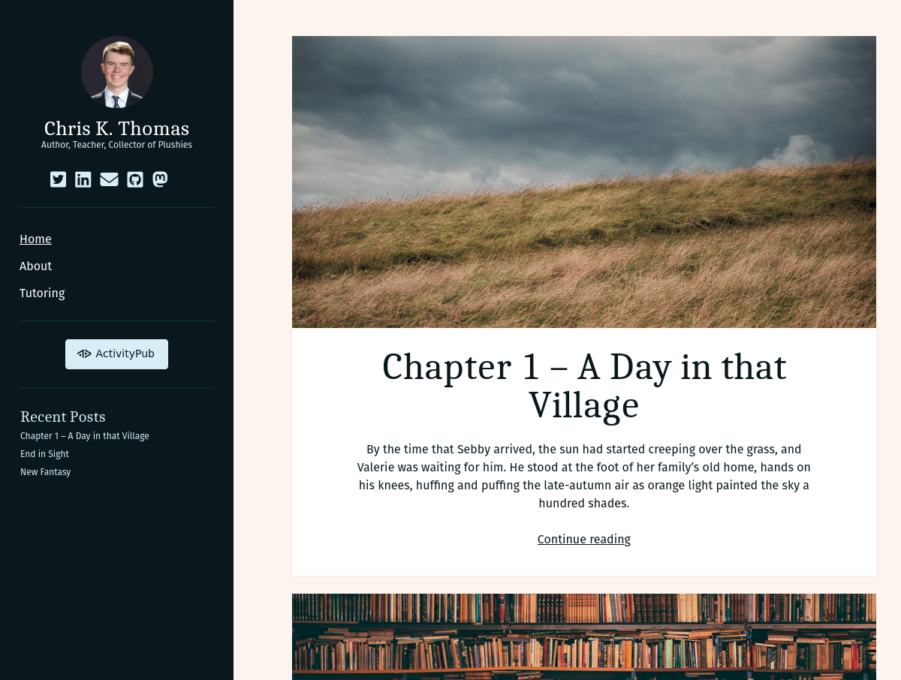

# author-child

A child theme of [Author by Compete Themes](https://github.com/BenSibley/Author). This will not work without the [Font Awesome Wordpress Plugin](https://wordpress.org/plugins/font-awesome/) or some other way to load the Font Awesome icons.

## SASS Folder

I do not intend to edit any sass files except for the `style.scss` file and the `_variables.scss` file. Other customizations will be placed in the `_child_theme.scss` file.
